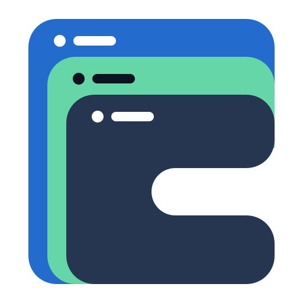
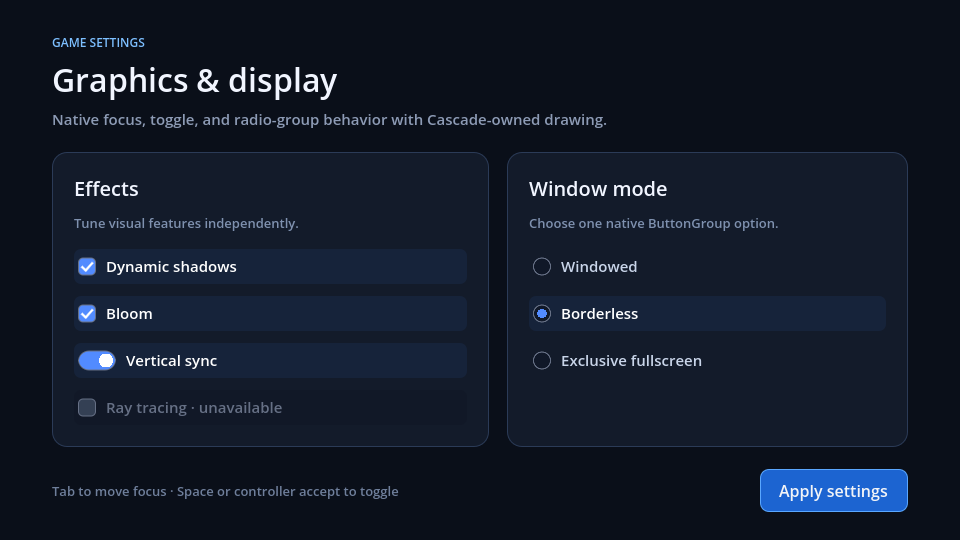
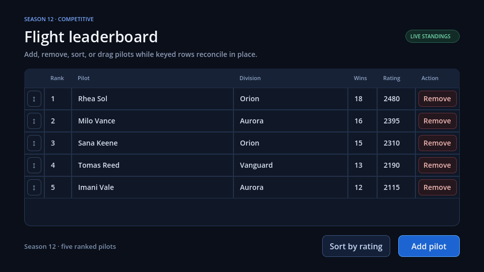
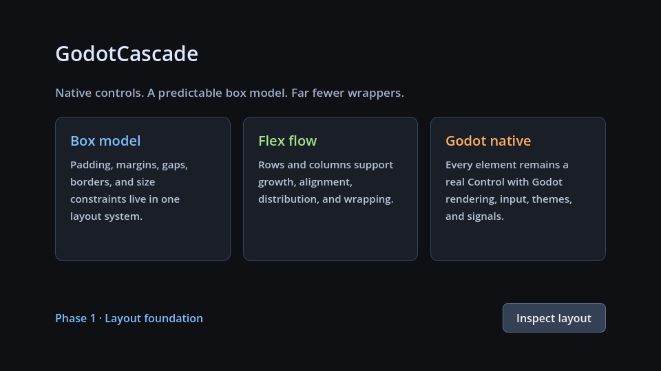
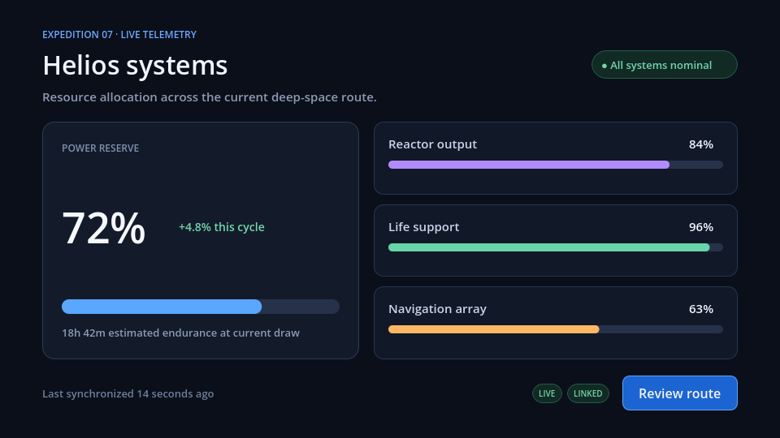

<p align="center">
  
</p>

# GodotCascade

[](https://github.com/mfagerlund/GodotCascade/actions/workflows/ci.yml)

[](LICENSE)


GodotCascade is an experimental retained-mode UI framework for Godot 4. It brings a declarative UI language, CSS-inspired styling, and a predictable box model to native Godot `Control` nodes.

The goal is to make game UI faster to build and easier to maintain without embedding a browser or replacing Godot's renderer. A GodotCascade interface remains a tree of native controls, so it can continue to use Godot's signals, themes, input, rendering, and editor tooling.

> [!IMPORTANT]
> GodotCascade 0.5.0 is the current experimental preview for Godot 4.7, adding targeted path invalidation, broader native state bindings, and exact boolean conditional rendering without becoming a browser engine. APIs outside the documented preview references remain unstable.

## Native Godot renders

These are automated captures of the actual source-generated Godot scenes—not browser mockups.

| Settings, validation, and two-way binding | Dynamic semantic table |
| --- | --- |
|  |  |
| **Grid, stack, image, and box model** | **Bound telemetry and progress** |
|  |  |

Run the same pages interactively with `python tools/showcase/run_showcase.py --godot "C:\path\to\godot.exe"`, or open the [public HTML/native parity report](https://mfagerlund.github.io/GodotCascade/showcase/).

The short [native-tree live-reload recording](docs/live-reload-demo.md) shows actual GXML and GCSS edits changing a Godot-rendered card while the keyed `CascadePanel` keeps the same engine instance ID.

## Why GodotCascade?

Godot's container system is capable, but non-trivial interfaces often require deeply nested scene trees. Spacing can be split between several containers, theme constants, and wrapper controls, making the visual intent difficult to see.

GodotCascade is built around a few ideas:

- one consistent box model for margin, padding, border, and size;
- flex, grid, and stack/overlay layout without excessive wrapper nodes;
- reusable styles separated from scene structure;
- declarative markup for concise, reviewable interfaces;
- hot reload for short iteration cycles;
- native Godot controls at runtime.

## The current authoring experience

Markup files use the `.gxml` extension:

```xml
<Page class="hud">
    <Label class="title" text="{player.name}" />
    <Label class="caption">Health</Label>
    <Progress value="{player.health}" max="100" />
    <Button id="inspect">Inspect loadout</Button>
</Page>
```

Stylesheets provide layout and appearance:

```css
.hud {
    min-width: 420px;
    padding: 24px;
    display: flex;
    flex-direction: column;
    gap: 16px;
    background: #26292f;
    border-radius: 8px;
}

.title {
    font-size: 26px;
}

#inspect { background: #344054; }
#inspect:hover { background: #475467; }
#inspect:pressed { background: #1d2939; }
```

Bindings connect the interface to game state:

```xml
<Label text="{player.name}" />
<Progress value="{player.health}" max="100" />
<Button disabled="{player.busy}">Repair</Button>
<TextInput bind-text="{player.name}" required="true" />
```

These formats deliberately borrow familiar ideas from HTML and CSS, but they are small, Godot-specific languages. GodotCascade is not a browser engine and does not aim for web standards compatibility.

## Sixty-second runnable demo

The complete [README quickstart scene](examples/readme_quickstart/readme_demo.tscn) is checked into the repository. Run it directly with:

```shell
godot --path . res://examples/readme_quickstart/readme_demo.tscn
```

Its [GXML](examples/readme_quickstart/interface.gxml) declares the native controls and bindings:

```xml
<Page class="demo">
    <Label class="title" text="{player.name}" />
    <Label text="{player.status}" />
    <Progress value="{player.health}" max="100" />
    <Row class="actions">
        <Label text="{player.health}" />
        <Button id="repair" on-pressed="_on_repair">Repair armor</Button>
    </Row>
</Page>
```

Its [GCSS](examples/readme_quickstart/styles.gcss) owns layout, box model, and interaction styling:

```css
.demo {
    --space: 16px;
    --accent: #5aa7ff;
    --primary: #246bce;
    display: flex;
    flex-direction: column;
    gap: var(--space);
    padding: calc(var(--space) * 2.5);
    background: #0b1220;
}

Label { color: #e8eefc; }

Button {
    padding: 10px 16px;
    background: var(--primary);
    color: #ffffff;
    border: 1px solid var(--accent);
    border-radius: 8px;
}

Button:hover { background: #347ee5; }
Button:pressed { background: #1d58ad; }
```

The [GDScript controller](examples/readme_quickstart/readme_demo.gd) supplies typed state and handles the authored event. Changing nested state is explicit: mutate it, then call `refresh_bindings()`.

```gdscript
extends "res://addons/godot_cascade/runtime/cascade_document.gd"

class PlayerState extends RefCounted:
    var name := "Rhea"
    var status := "Armor reserve"
    var health := 72.0

var player := PlayerState.new()

func _ready() -> void:
    binding_context = {"player": player}
    event_context = self
    super()

func _on_repair() -> void:
    player.health = minf(player.health + 10.0, 100.0)
    player.status = "Armor repaired"
    refresh_bindings()
```

For larger examples, see the complete [settings state](examples/showcase/settings_menu/settings_menu_state.gd), [settings controller](examples/showcase/settings_menu/settings_menu_document.gd), [leaderboard state](examples/showcase/leaderboard/leaderboard_state.gd), and [add/remove/sort/drag controller](examples/showcase/leaderboard/leaderboard_document.gd).

## What works today

The repository currently contains several working vertical slices:

- an installable Godot 4 editor addon;
- `CascadeBox`, a native `Container` with row and column flow;
- padding, child margins, gap, preferred/min/max sizing;
- start, center, end, stretch, and space distribution;
- basic flex growth and wrapping;
- optional background, border, and corner radius drawing;
- a shared `CascadeStyle` resource consumed by layout and owned components;
- `CascadeButton`, an owned `BaseButton` implementation with exact box-model sizing;
- `CascadeLabel`, with a GodotCascade box around native text shaping and wrapping;
- `CascadePanel`, the semantic styled-container component;
- `CascadeProgress`, an owned range display with exact track, fill, padding, border, and radius drawing;
- `CascadeImage`, an owned texture control with deterministic contain, cover, fill, and crop geometry;
- a recoverable `.gxml` parser and native control registry;
- a focused `.gcss` subset with type/class/ID, descendant/direct-child selectors, specificity, inheritance, source order, case-sensitive custom properties, typed `calc()`, layout values, and native pseudo states;
- `CascadeDocument`, which builds the running native UI directly from paired source files;
- content-based source watching with automatic runtime reloads;
- `.gxml`/`.gcss` import resources plus a docked live preview, Inspector summary, dependency/invalidation-aware layout debugger, and source navigation;
- stable ID and structural keys that reconcile edits into the existing native tree;
- last-valid rendering when an in-progress edit has parser or builder errors;
- focused `{dot.separated.path}` one-way bindings, explicit writable form bindings, and optional typed C# partial generation;
- keyed `Repeat` collections, `on-*` event methods, and registered custom-component lifecycle hooks;
- reusable source-level GXML components with typed parameters, default/named slots, scoped IDs, and identity-preserving hot reload;
- four source-generated parity scenes covering layout, media, components, form controls, bound telemetry data, and semantic tables.

Version 0.2 adds native single-line text editing, validation, and explicit `bind-*` write-back while retaining the 0.1 source surface. Version 0.3 also adapts native `TextEdit` through `TextInput multiline="true"`, adds keyed repeated-item write-back, and supports hover backgrounds on owned layout containers. Browser-wide property coverage remains out of scope.

## How it compares

GodotCascade is not the only declarative UI project for Godot. The closest alternatives are excellent projects with different priorities:

| | GodotCascade | [GTML](https://github.com/Niekvdm/godot-plugins-gtml) | [Reactive UI Toolkit](https://github.com/reactive-ui-toolkit/ruitk-godot) | [GUML](https://github.com/shitake2333/GUML) |
| --- | --- | --- | --- | --- |
| Primary model | Focused GXML + GCSS | HTML/CSS + Vue-style directives | Compiled JSX-like GDScript + hooks | QML/XAML-like Godot .NET markup |
| Runtime output | Native `Control` tree | Native `Control` tree | Any instantiable Godot `Node` | Built-in Godot `Control` types |
| State updates | Typed paths, targeted invalidation, opt-in write-back | Automatic reactive store + expressions | Fiber rendering, hooks, signals, context | Generated one/two-way C# bindings |
| Styling | Constrained cascade with custom properties, typed calculations, and deterministic box/flex/grid/table layout | Broad CSS-like surface with variables, calculations, transforms, gradients, SVG, and fonts | Godot properties, themes, state styleboxes | Godot properties through generated markup |
| Reload model | Last-valid candidate + keyed native reconciliation | Live reactive reconciliation | Fast Refresh with hook-state preservation | Compile-time Roslyn generation |
| Main trade-off | Small language and explicit unsupported diagnostics | Broader runtime and expression surface | React-scale framework and concepts | Requires Godot .NET |

Choose GodotCascade when you want a reviewable source format, native controls, CSS-like cascade and layout, deterministic diagnostics, and no embedded expression runtime. Choose one of the alternatives when automatic reactivity, arbitrary expressions, every Godot node, React-style composition, or .NET-only compile-time generation matters more.

### Capabilities the alternatives currently have that GodotCascade lacks

- automatic dependency-tracked reactivity; mutations still require an explicit full or named-path invalidation;
- general expressions and Vue/JSX-style control flow beyond exact boolean path conditions;
- an open vocabulary covering every built-in `Control` or arbitrary `Node`;
- broader CSS features such as opacity, transforms, gradients, custom fonts, inline SVG, percentages, and browser-wide value functions;
- `autofocus`, authored tab order, modal focus traps, and higher-level routing;
- hooks, context, effects, Suspense, memoization, time-slicing, and declarative item-model adapters;
- virtualized large collections;
- VS Code/Visual Studio language tooling with completion, hover, rename, and go-to-definition.

Those are roadmap inputs, not promises to reproduce a browser or React. New features must preserve the focused grammar, native behavior, and actionable failure model.

## Trying the preview

Requirements: Godot 4.7. The addon runtime is GDScript-only; .NET is needed only if a Godot .NET project opts into generated C# bindings.

To install in another project:

1. Download the latest `godot-cascade-X.Y.Z.zip` from [Releases](https://github.com/mfagerlund/GodotCascade/releases).
2. Extract it at the project root so `res://addons/godot_cascade/plugin.cfg` exists.
3. Enable **GodotCascade** under **Project → Project Settings → Plugins**.
4. Follow the [getting-started guide](docs/getting-started.md), or copy the [README quickstart](examples/readme_quickstart/) into the project.

To work from this repository, open it with Godot 4.7 and run the project. The configured main scene is `examples/showcase_app.tscn`, a manifest-driven browser for every native showcase page. Add a **CascadeBox** from the Create New Node dialog to experiment in your own scene.

No external runtime dependencies are required.

You can also launch the same app from a terminal and optionally open one page directly:

```powershell
python tools/showcase/run_showcase.py --godot "C:\path\to\godot.exe"
python tools/showcase/run_showcase.py --godot "C:\path\to\godot.exe" --page settings-menu
```

Use Previous, Next, or the page picker to exercise each manifest entry. Reload rebuilds the current document, and the toolbar reports live document diagnostics. See the [runnable showcase guide](docs/showcase-app.md) for the connection checks on each page.

### Live source editing

`CascadeDocument` watches its `markup_path` and `stylesheet_path` by default. Save either source file while the project is running and the document rebuilds a candidate tree, then reconciles it into the live native controls. Elements with an `id` keep identity across reordering; unkeyed elements use their structural path. Compatible controls retain their Godot instance, focus, runtime state, and signal connections while authored properties update.

If an edit is invalid, `diagnostics_changed` is emitted and the previous valid UI remains on screen. Fixing and saving the source applies the next valid candidate. Set `watch_sources` to `false` to disable polling, or call `poll_sources()` when integrating with an editor-owned watcher.

### One-way data binding

Exact brace expressions resolve against a typed Godot object—or a Dictionary for JSON-shaped data and prototypes—assigned to `CascadeDocument.binding_context`:

```xml
<Label text="{player.name}" />
<Progress value="{player.health}" max="100" />
```

```gdscript
class PlayerState extends RefCounted:
    var name := "Rhea"
    var health := 72.0

class HudState extends RefCounted:
    var player := PlayerState.new()

var state := HudState.new()
document.binding_context = state

# After mutating nested state:
state.player.health = 54.0
document.refresh_bindings()
```

Assigning a new context refreshes automatically. The focused one-way surface covers text and ranges plus visibility, disabled/checked state, select values, image sources, and dynamic class lists. Use `ObservableBindingContext.invalidate("player.health")` for targeted updates without polling. Bound class changes rematch selectors through keyed reconciliation; unresolved paths and wrong value types produce diagnostics instead of executing expressions or methods.

### Writable form binding and validation

Writable bindings are opt-in, so existing `{path}` attributes remain one-way:

```xml
<TextInput bind-text="{settings.profile}" required="true" pattern="^.{2,16}$" />
<Checkbox bind-checked="{settings.shadows}">Dynamic shadows</Checkbox>
<Slider min="75" max="125" bind-value="{settings.ui_scale}" />
<Select bind-selected="{settings.quality}">…</Select>
```

Native edits assign only existing typed object, array, or Dictionary paths, emit `binding_value_changed`, and refresh dependent one-way controls. `CascadeDocument.validate()` evaluates adapted controls and publishes validation diagnostics. No expressions, converters, implicit object creation, or method calls are involved.

Godot .NET projects can also declare `@Name` bindings in GXML and generate a disposable partial class with typed getter/setter methods implemented in a permanent companion partial. Inline formatter and parser bodies are copied verbatim with source mappings; there is no runtime expression interpreter. See the [binding guide](docs/bindings.md) for the generation command, exact contract, dynamic path grammar, repeated scopes, events, diagnostics, and limits.

## Components and interactive states

The executable GXML elements are `Page`, `Row`, `Column`, `Panel`, `Label`, `Button`, `Checkbox`, `RadioButton`/`Radio`, `Switch`, `Select`/`Option`, `Slider`, `Progress`, `Scroll`, semantic `Table` header/body/row/cell elements, and the adapted `TextInput`. GodotCascade owns the measurement and drawing of its exact components while native `ScrollContainer`, `LineEdit`, and `TextEdit` retain scrolling and editing behavior behind documented adapters.

Button state selectors respond dynamically to Godot's native interaction state:

```css
Button:hover { background: #475467; }
Button:pressed { background: #1d2939; }
Button:focused { border-color: #84adff; border-width: 2px; }
Button:disabled { background: #1f2937; color: #98a2b3; }
Checkbox:checked { background: #1d2939; color: #ffffff; }
TextInput:invalid { border-color: #f97066; }
TextInput:focus-visible { border-color: #84adff; border-width: 2px; }
```

This is a focused subset, not browser-wide pseudo-class support. Owned interactive controls share native state precedence and styling; selects support `:open`, text inputs support `:invalid`, and interactive borders support `:focus-visible`. Arbitrary-container hover and pseudo-state animation remain outside the preview. Reconciliation-time property transitions have a separate interruption contract. See the [current support reference](docs/current-support.md) for the exact element, selector, property, and state matrices.

Run the current headless smoke test with:

```shell
godot --headless --path . --script res://tests/layout_smoke_test.gd
godot --headless --path . --script res://tests/flex_layout_engine_test.gd
godot --headless --path . --script res://tests/component_test.gd
godot --headless --path . --script res://tests/source_pipeline_test.gd
godot --headless --path . --script res://tests/showcase_app_test.gd
```

## Using `CascadeBox`

`CascadeBox` works like any other Godot `Container`. Add child `Control` nodes, choose a direction, configure flow and gap on the container, and edit its shared `CascadeStyle` resource for padding, margin, constraints, background, and border.

Cascade-aware children expose their own margin and flex properties. For ordinary Godot controls, the same values can be attached as metadata:

```gdscript
button.set_meta("cascade_margin_left", 8.0)
button.set_meta("cascade_margin_right", 8.0)
button.set_meta("cascade_flex_grow", 1.0)
button.set_meta("cascade_min_width", 120.0)
```

Supported child metadata keys are:

```text
cascade_margin_left      cascade_margin_top
cascade_margin_right     cascade_margin_bottom
cascade_flex_grow
cascade_align_self        # 0 auto, 1 start, 2 center, 3 end, 4 stretch
cascade_preferred_width  cascade_preferred_height
cascade_min_width        cascade_min_height
cascade_max_width        cascade_max_height
```

The metadata bridge is an early compatibility mechanism. Later phases will apply these values through the style engine, so standard controls will not need wrappers or manual metadata.

Final layout rectangles are pixel-snapped by rounding their leading and trailing edges independently, preserving shared boundaries while avoiding fractional rendering blur. Set `pixel_snap` to `false` on `CascadeBox` when subpixel geometry is intentional. `CascadeStyle.overflow` explicitly selects visible or clipped content, and `align_self` overrides a parent's cross-axis alignment for one item.

GodotCascade owns the visual implementation of its core components so supported CSS settings have exact, shared semantics. Those components still derive from useful native primitives—for example, `CascadeButton` derives from `BaseButton` to retain focus, activation, toggle, shortcut, accessibility, and signal behavior. Ordinary Godot controls remain usable through [documented compatibility tiers](docs/compatibility-tiers.md). See [ADR 0001](docs/decisions/0001-owned-core-controls.md) for the decision and tradeoffs.

### Using `CascadeButton`

Add a **CascadeButton** from the Create New Node dialog after enabling the addon. Its inspector exposes content and state appearance directly; shared padding, margin, sizing, background, and border values live in its `CascadeStyle` resource. Because it derives from `BaseButton`, connect `pressed`, `button_down`, `button_up`, and `toggled` exactly as you would for a native Godot button.

## HTML parity showcase

The generated [public parity showcase](https://mfagerlund.github.io/GodotCascade/showcase/) presents each demo as a fixed-viewport HTML reference beside an actual capture of its source-generated GodotCascade scene. It includes the executable `.gxml` and `.gcss` translation and a semantic mapping table. The current demos cover flex/box, grid/stack overlays, a telemetry dashboard, native form controls, and a semantic leaderboard that adds, removes, sorts, and drag-reorders keyed rows. The [runnable Godot app](docs/showcase-app.md) loads those same manifest entries for direct interaction testing; the [repository copy](docs/showcase/index.html) works offline.

Showcases are registered in `examples/showcase/manifest.json`. A demo keeps four artifacts together:

- the original HTML reference;
- proposed GodotCascade markup and stylesheet;
- the current native Godot scene;
- a captured Godot render.

Build the showcase on Windows with:

```powershell
./tools/showcase/build_showcase.ps1 -GodotPath "C:\path\to\godot.exe"
```

The capture requires a real graphics display rather than Godot's dummy headless renderer. The generator itself uses only Python's standard library:

```shell
python tools/showcase/generate_showcase.py
python tools/showcase/generate_showcase.py --check
```

Run the production performance/allocation gate with:

```powershell
godot --headless --path . --script benchmarks/pipeline_benchmark.gd
```

Run the repository integrity, packaging, and clean-install gates with:

```powershell
python tools/ci/verify_repo.py
python tools/showcase/generate_showcase.py --check
python tools/release/package_addon.py
python tools/release/clean_install_smoke.py --godot path/to/godot
```

See the [changelog](CHANGELOG.md), [0.5.0 release notes](docs/releases/0.5.0.md), [TextInput certification matrix](docs/text-input-certification.md), and [release process](docs/release-process.md). CI runs the same headless suites, benchmark, editor import scan, generated-showcase check, deterministic packaging step, and clean-project installation smoke test.

## Architecture

```text
GXML + GCSS ──→ parsers ──→ off-tree native candidate
                                      │
                                      ▼
binding context ──→ reconciler ──→ live native Controls
                                      │
                                      ▼
                           flex/grid layout engines
```

The major boundaries are intentionally separate:

- **Parser:** turns source files into logical syntax trees and diagnostics.
- **UI tree:** carries authored elements into keyed native candidates with binding metadata.
- **Style engine:** matches the focused selector/property subset and applies typed values.
- **Layout engine:** translates box/flex and grid rules into control rectangles; stack overlays provide a constrained absolute-inset escape hatch.
- **Reconciler:** updates existing Godot nodes while preserving runtime state and signal connections.
- **Tooling:** imports source diagnostics, hosts the watched native preview, exposes Inspector/debug snapshots and GXML source navigation, and generates the HTML/native parity report.

See [getting started](docs/getting-started.md), the [documentation index](docs/README.md), [architecture](docs/architecture.md), [current support reference](docs/current-support.md), and [roadmap](ROADMAP.md).

## Project principles

1. **Godot-native output.** Rendering and interaction stay in `Control` nodes.
2. **A focused language.** Implement useful UI concepts, not arbitrary HTML or CSS.
3. **Deterministic layout.** The same inputs must produce the same rectangles.
4. **Incremental updates.** Hot reload should preserve node identity where possible.
5. **Actionable diagnostics.** Invalid markup and styles should identify the source and suggest a fix.
6. **Pay only for what changes.** Style, layout, and reconciliation should be independently invalidated.

## Roadmap

The first nine vertical slices—layout, styling, markup, tooling, form controls, scoped/multiline forms, typed C# bindings, semantic tables, and automatic scrolling—are complete for the experimental preview.

The next pipeline is intentionally validation-first:

1. **Public validation:** submit the prepared 0.5 testing-level Asset Library entry after maintainer approval, share the native live-reload artifact, and compare one production-shaped UI directly with GTML.
2. **Focused reactivity and composition:** completed observable path invalidation, broader bound properties, exact conditions, reusable typed GXML components, and dependency/invalidation traces in the debugger.
3. **Language and editor depth:** completed focused custom properties and typed `calc()`; next are the highest-value missing style primitives, focus traps/tab order, and real completion/hover/rename/go-to-definition tooling.
4. **Scale and platform confidence:** collection-only updates, item models and virtualization, representative benchmarks, multi-platform CI, and manual IME/touch/screen-reader certification.

The detailed acceptance criteria and remaining engineering findings live in the [roadmap](ROADMAP.md).

## Contributing

The project is young enough that API decisions are still inexpensive to change. Before adding a large feature, write down the user-facing behavior, define how invalid input is diagnosed, and keep parsing, style resolution, layout, and node mutation separable.

When contributing code:

- target the minimum supported Godot version documented above;
- keep addon code under `addons/godot_cascade/`;
- add focused examples for visible behavior;
- avoid relying on editor-only APIs at runtime;
- document intentional differences from CSS.

## Non-goals

GodotCascade will not support arbitrary HTML, JavaScript, DOM APIs, full CSS compatibility, or general web content. It is a UI toolkit for Godot, not a web platform.

## License

GodotCascade is released under [The Unlicense](LICENSE): use, modify, publish, sell, or redistribute it for any purpose, with no attribution condition. A copy is included inside `addons/godot_cascade/` so it remains with Asset Library installations.
