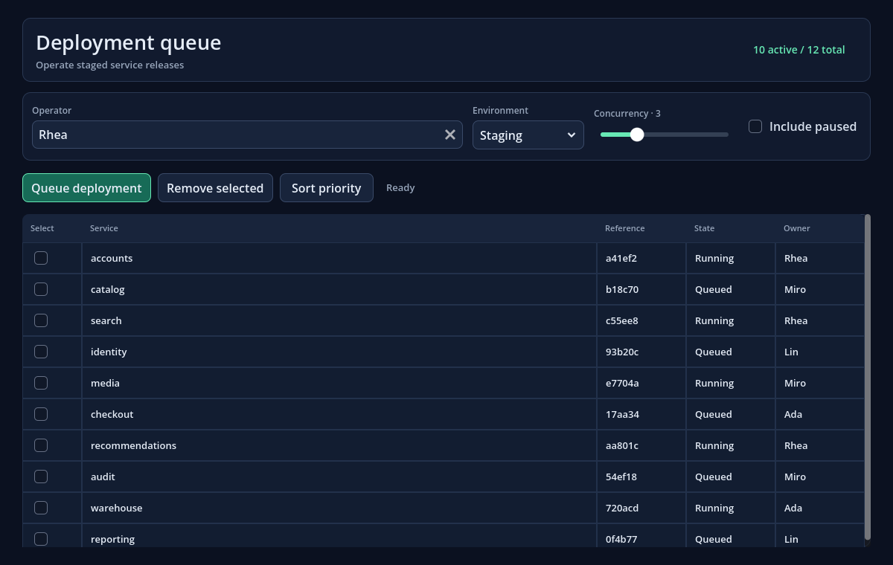
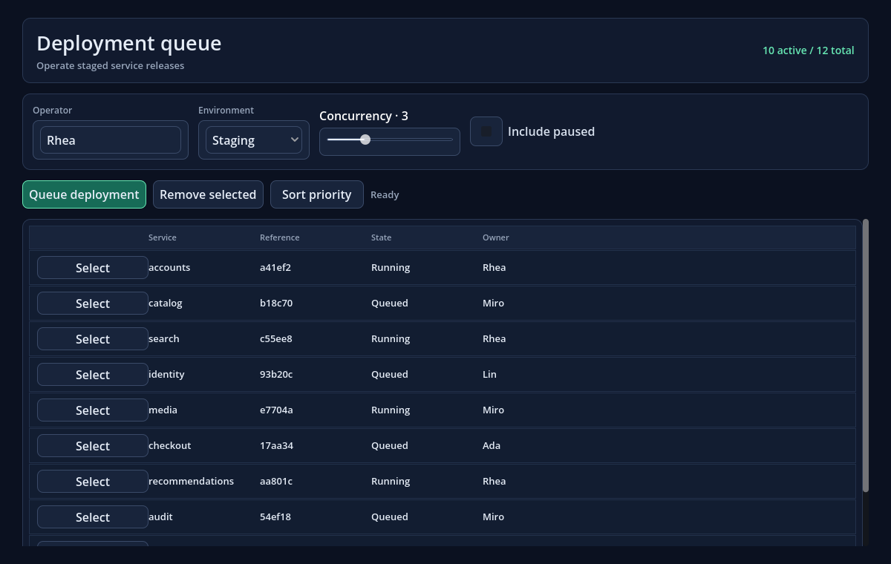

# GodotCascade versus GTML: deployment queue

Date: 2026-08-07

This is an intentionally candid comparison of one production-shaped operations screen, not a showcase scene. Independent GodotCascade and GTML implementations load the same 12-job fixture and expose the same tested workflow: editable deployment settings, validation, filtering, queue/add/remove, row selection and writeback, keyed priority sorting, status summaries, and malformed-source behavior.

The complete fixture, implementations, verification scripts, and runner live in [`comparisons/deployment-queue`](../../comparisons/deployment-queue/README.md). GTML is not vendored: the runner checks out and verifies upstream commit `7ddabfe3cffa69d7c8abd12b8d69bf80de49e59f` (`plugin.cfg` version `0.8.4`) in a temporary directory. Both sides were executed with the SHA-verified official Godot 4.7.1 Windows console build.

## Native captures

| GodotCascade | GTML |
|---|---|
|  |  |

The visual designs are deliberately comparable rather than pixel-identical. GodotCascade uses its semantic native table; GTML uses an idiomatic flex row list.

## Functional result

Both implementations passed the complete scripted workflow:

- 12 fixture jobs loaded, with 10 initially visible and all 12 visible after enabling paused items;
- operator/environment/concurrency form values wrote back;
- an invalid operator prevented queueing;
- add then remove returned the queue to 12 rows;
- row state wrote back;
- priority sorting produced the expected order and preserved the keyed row control's native identity;
- the final rendered endpoint matched the mutated state.

The diagnostic behavior differs. GodotCascade rejected an unsupported GXML element and retained the last valid native tree. GTML warned about the deliberately mismatched closing tag and recovered a new parsed tree rather than retaining its previous tree. Both behaviors are usable, but GodotCascade's last-valid policy is safer for live source editing.

## Measurements

All values below are complete synchronous operations in milliseconds—never per-frame values. Cold build is the median of ten samples. Batch endpoints were rendered and checked. See the machine-readable [result file](deployment-queue-results.json) for every sample, process diagnostic count, and capture size.

| Measurement | GodotCascade | GTML | Interpretation |
|---|---:|---:|---|
| Cold build median | 91.014 ms | 33.949 ms | GTML was about 2.68× faster in this fixture |
| 100 individually rendered top-level scalar updates | 50.790 ms total | 1.208 ms total | Retained dependency routing removed about 98.83% of Cascade's original batch time; GTML remained about 42.05× faster |
| 100 scalar mutations, one Cascade refresh | 0.987 ms total | n/a | Coalescing remains the cheapest Cascade path, at about 0.010 ms per mutation in this batch |
| 40 pure keyed priority reorders | 986.843 ms total | 24.948 ms total | Zero-candidate retained row moves removed about 91.85% of Cascade's original batch time; GTML remained about 39.56× faster |
| Native controls after build | 103 | 132 | Neither implementation materializes a browser DOM; the structures differ |
| Nonblank runtime UI source | 381 lines | 329 lines | Cascade used about 16% more physical source in this implementation |

The first published run measured 185.360 ms cold build, 4,357.338 ms for the scalar batch, 40.894 ms for the coalesced batch, and 12,109.040 ms for the reorder batch. That run exposed three full-tree taxes: uncached focus property inspection, full-tree dependency/trace routing for named paths, and Repeat-candidate construction for an Array containing the same keyed item objects in a new order. The rerun above uses retained binding/dependency indexes and an atomic pure-reorder path. Named `item.status`-style invalidations now update matching materialized row controls directly; structural/class dependencies, replaced item identities, changed keys, nested Repeats, and virtual windows still fall back to validated candidate reconciliation.

The scalar batch changes the top-level `status_message`; it never was a per-frame measurement and does not exercise Repeat reconstruction. The keyed batch is deliberately the narrow safe reorder case. These distinctions matter: the result demonstrates that the identified hot paths were removed, not that arbitrary collection replacement is now free.

These are local microbenchmarks of one screen, not general throughput rankings. They exclude import/editor startup, use one Windows machine, and do not measure GPU frame time, memory, authoring time, or team familiarity. GTML's HTML-like authoring and reactive updates remain materially faster here. GodotCascade's advantages in this fixture are native semantic table structure, stricter source diagnostics, last-valid reload behavior, explicit fixed contracts, and a dependency-free addon surface.

## Conclusion

The comparison does not make GodotCascade pointless, but it still rules out claiming that it is a faster or more ergonomic general replacement for GTML. GodotCascade is useful when a project values native Godot controls, GCSS-style owned layout components, semantic tables/forms, deterministic diagnostics, and last-valid source reloads. GTML is the stronger choice when HTML familiarity and maximum fine-grained reactive throughput dominate.

Publishing GodotCascade as an experimental project remains worthwhile if communication is equally direct about the remaining performance gap and asks the Godot community to validate the authoring model on real interfaces. The prescribed technical response—retained property-level routing, zero-candidate pure keyed reorders, and an exact pinned rerun—is now complete. Replaced items and structural row changes intentionally retain the slower transactional candidate path.

## Reproduce

```powershell
python comparisons/deployment-queue/run_comparison.py `
  --godot "C:\path\to\Godot_v4.7.1-stable_win64_console.exe" `
  --capture
```

The runner verifies the GTML commit, functional assertions, rendered endpoints, identity retention, diagnostics, source metrics, captures, and JSON output. Its temporary GTML checkout is removed after the run.
