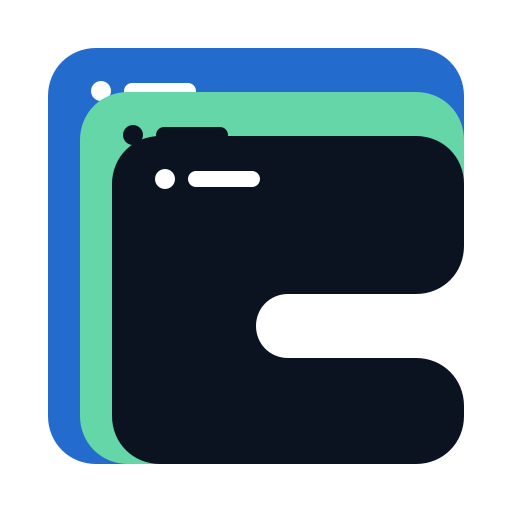

# GodotCascade logo concepts

These began as image-model explorations. The cascading-native-windows direction was selected, redrawn as deterministic SVG geometry, tested at 16, 32, 64, 128, and 512 pixels, and adopted as the project mark.

## 1. Cascading native windows — selected

The clearest connection to the product name and native UI output. It has the strongest silhouette, but the generated rendering needs simplification to truly flat fills.

Prompt direction: three cascading rounded UI panels forming a clean `C`, suggesting layered style rules and native controls; navy, interface blue, and mint.

### Developed mark

The selected direction is now expressed as deterministic SVG geometry with flat fills from the showcase palette. The nested windows form the `C` rather than placing a separate letter over them. Minimal title-bar controls preserve the native-window reading without depending on detail.

- [Open the canonical project SVG](../../../icon.svg)
- [Open the canonical square PNG](../../../icon.png)
- [Open the 128/64/32/16 px comparison](concept-1-size-study.html)
- [Open the development SVG](godot-cascade-mark.svg)
- [Open the transparent 512 px PNG](godot-cascade-mark-512.png)
- [Open the Asset Library-sized 128 px PNG](godot-cascade-mark-128.png)
- [Open the image-model refinement study](concept-1-refinement-study.png)

## 2. Markup to native tree

The clearest technical explanation: source markup becomes a retained native node tree. It is immediately readable to developers, although angle-bracket marks are common in developer tooling.

Prompt direction: minimal markup brackets connected to three descending square UI nodes; navy and interface blue.

## 3. Deterministic layout cascade

The most abstract and potentially ownable direction. It suggests layout tracks, hierarchy, and cascade without depending on a literal letter or browser metaphor.

Prompt direction: staggered rounded layout tiles descending like a rule cascade, with subtle `C`/`G` negative space; navy, blue, and mint.

All three concepts were generated with the built-in image-generation tool using the `logo-brand` workflow. Shared constraints were: symbol only, vector-friendly geometry, strong small-size silhouette, no Godot robot, no existing framework marks, no mockup, and no watermark.
