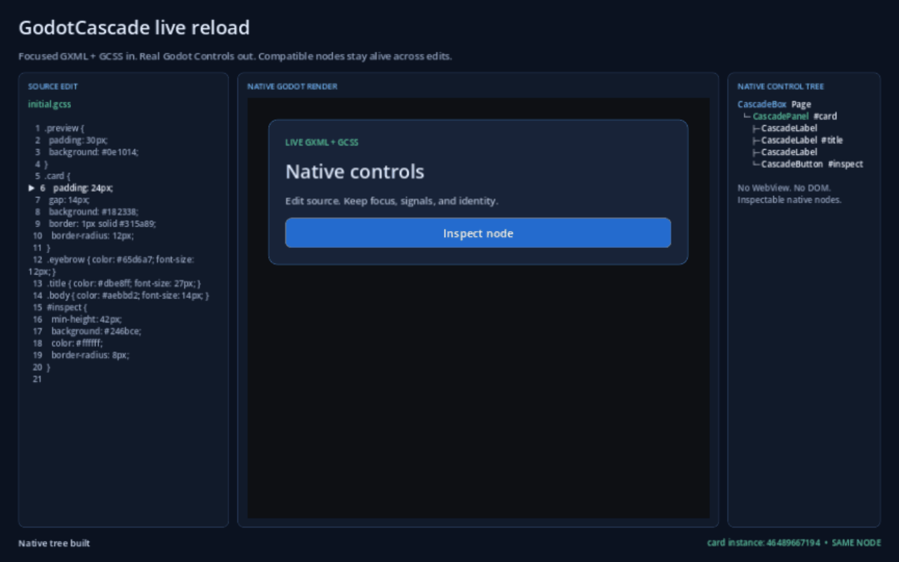

# Native-tree live reload



This seven-second recording is rendered by Godot, not recreated in HTML. A `CascadeDocument` reads temporary GXML and GCSS sources, then the demo changes each file and calls the same `poll_sources()` path used by the runtime watcher. The card's background, border, title, and body update while its Godot instance ID remains unchanged.

The generated tree contains ordinary `CascadeBox`, `CascadePanel`, `CascadeLabel`, and `CascadeButton` nodes derived from Godot `Control` primitives. Compatible keyed nodes are reconciled in place, retaining identity, focus, runtime editing state, user signal connections, and component lifecycle state.

Re-record it with Godot 4.7 and Pillow:

```powershell
python tools/showcase/capture_live_reload_demo.py --godot "C:\path\to\Godot_v4.7-stable_win64_console.exe"
```

The executable source is [live_reload_demo.gd](../examples/live_reload_demo/live_reload_demo.gd); the wider [runnable showcase app](showcase-app.md) exercises every parity page interactively.
