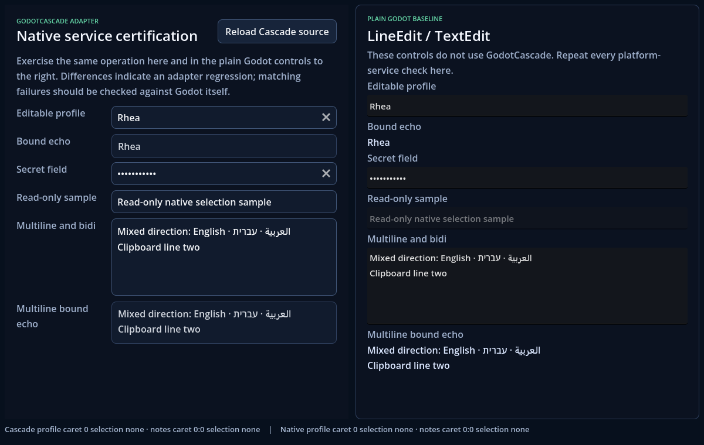

# Manual platform certification protocol

This protocol covers behavior that a headless runner cannot prove. Use the dedicated side-by-side fixture: its left half contains GodotCascade adapters and its right half contains plain Godot `LineEdit`/`TextEdit` controls with the same content and states. It includes editable, secret, read-only, multiline, bidirectional, bound-echo, caret, and selection surfaces.



```powershell
python tools/platform/certification.py launch --godot path/to/godot
```

The ordinary settings showcase remains useful for Select, Slider, checkbox, radio, switch, validation, and focus-order coverage:

```powershell
python tools/showcase/run_showcase.py --godot path/to/godot --page settings-menu
```

Create an evidence record before testing. The command records the host, commit, and Godot build when available but deliberately leaves unproven fields and every result as incomplete:

```powershell
python tools/platform/certification.py create --platform windows --godot path/to/godot
```

## Required checks

| Area | Procedure | Passing evidence |
| --- | --- | --- |
| Clipboard | Round-trip mixed Unicode and multiline text; copy, cut, paste, then undo/redo using platform shortcuts and context menus | Text/newlines, selection, caret, and writable bound echo remain exact |
| IME | Compose non-Latin text in both editors; move the candidate selection; commit and cancel composition | Candidate window tracks the native caret; commit occurs once; cancel leaves no partial write |
| Active IME reload | Begin composition without committing, trigger **Reload Cascade source**, then continue, commit, and repeat with cancellation | Composition is preserved or a precisely documented Cascade/native difference is filed; no duplicate commit occurs |
| Bidirectional text | Enter mixed Arabic/Hebrew, Latin, and numbers; select across direction boundaries | Native shaping, caret movement, selection, copy, and bound echo are coherent |
| Touch selection | Long-press, drag both selection handles, replace selection, and scroll multiline content | Handles remain usable and the page does not steal the gesture |
| Virtual keyboard | Focus each editor, change selection, submit/dismiss, rotate or resize where applicable | Keyboard appears/dismisses normally and focused content remains visible |
| Screen reader | Navigate every interactive control, edit both text fields, open Select, change Slider/toggles, and trigger validation | Exact name, role, checked/selected state, range value, selection, invalid message, and changes are announced |
| Keyboard/controller | Traverse forward/backward, activate controls, operate Select/Slider/radios, and enter/leave text editing | Authored order is deterministic; focus ring modality and native operations are correct |
| Reload | Keep a caret/selection and a focused control, then use the showcase Reload action | Compatible keyed controls preserve focus and native editing state |

For every failure, repeat the same operation in the fixture's plain-Godot half or the equivalent plain control in the settings page. Classify the result as GodotCascade-specific, upstream-native, assistive-technology-specific, or inconclusive. Do not mark the platform certified from visual inspection alone.

## Closure matrix

The global roadmap gate requires records for Windows, Linux, and macOS because the public support matrix currently makes automated claims for all three. Clipboard, IME, active-composition reload, bidirectional text, screen reader, keyboard/controller, and reload preservation must pass on each desktop. Touch selection and virtual keyboard must each pass on at least one applicable physical device; marking them unavailable on every desktop does not close the gate. Android and iOS remain unverified and are not support claims, but a mobile record may supply the required touch/virtual-keyboard evidence.

Headless tests confirm that the fixture loads and both sides remain native and writable on every CI desktop. They do not count as manual service evidence.

## Result record

Store completed evidence under `docs/artifacts/platform-certification-YYYY-MM-DD-<platform>.md` with this shape:

```markdown
# Platform certification — <platform>

- OS/device:
- Godot build:
- GodotCascade commit:
- Rendering backend:
- Keyboard/IME:
- Clipboard environment:
- Touch/virtual keyboard:
- Screen reader:

| Check | Result | Notes/evidence |
| --- | --- | --- |
| Clipboard | Pass/Fail/Unavailable | |
| IME | Pass/Fail/Unavailable | |
| Active IME reload | Pass/Fail/Unavailable | |
| Bidirectional text | Pass/Fail/Unavailable | |
| Touch selection | Pass/Fail/Unavailable | |
| Virtual keyboard | Pass/Fail/Unavailable | |
| Screen reader | Pass/Fail/Unavailable | |
| Keyboard/controller | Pass/Fail/Unavailable | |
| Reload preservation | Pass/Fail/Unavailable | |
```

A platform is manually certified only when every applicable row passes and unavailable hardware/services are stated explicitly. Automated results remain valid even when a manual service is unavailable; the support matrix must keep that distinction visible.

Validate completed records and the global closure without converting missing evidence into a pass:

```powershell
python tools/platform/certification.py validate --all --closure
```
